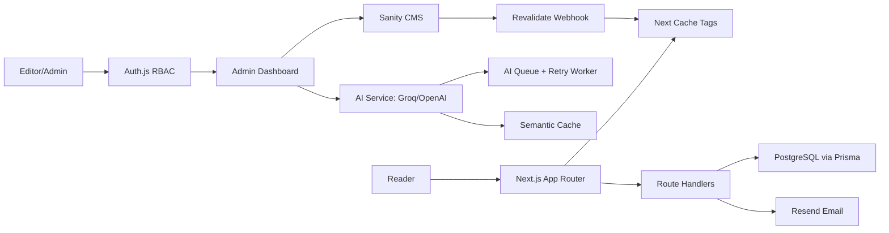

# clarift Architecture

## Boundaries

- `app/` contains route orchestration, metadata, streaming boundaries, and UI composition.
- `components/` contains reusable client and server UI.
- `lib/repositories/` owns persistence access and cursor pagination contracts.
- `lib/services/` owns business workflows: AI, Sanity, newsletter, analytics, and security.
- `lib/queue/` owns background job contracts and retry behavior.
- `prisma/` is the relational system of record for users, sessions, engagement, analytics, audit logs, notifications, and AI usage.
- `sanity/` is the editorial source of truth for rich published content.

## Rendering

- Public routes use Cache Components, `use cache`, `cacheLife`, and `cacheTag`.
- Blog, category, tag, and author pages expose `generateStaticParams`.
- Dynamic reader/admin surfaces stream behind Suspense.
- Sanity publish events call `/api/revalidate` to refresh `posts` and `post:{slug}` tags.

## Scale Strategy

- Redis can replace the in-memory queue/cache contracts without changing route callers.
- Postgres indexes support analytics, search history, comments, notifications, and AI usage queries.
- Vercel CDN serves static/PPR public routes while admin/API routes remain dynamic.
- `/api/health` supports uptime checks and deployment smoke tests.
